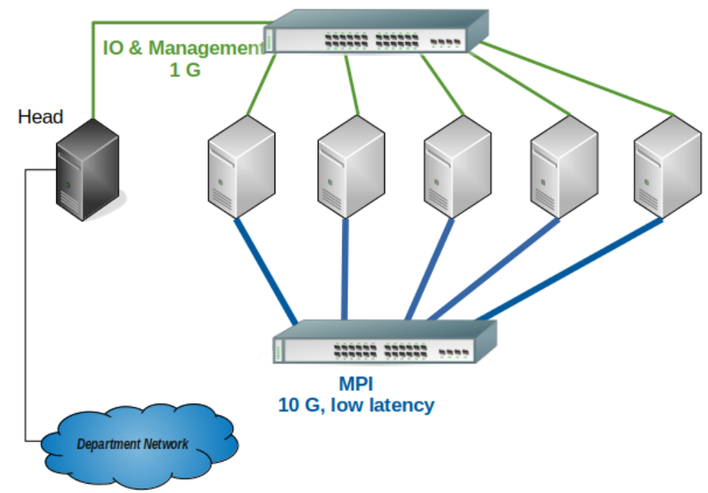

# About Scicluster

## A Gnu/Linux Cluster - one machine, consisting of many machines

On one hand you can look at Gnu/Linux clusters as rather large and powerful supercomputers,
but on the other hand you can look at them as just a large bunch of servers and some storage system(s)
connected with each other through a (high speed) network.
Both of these views are fully correct, and it's therefore important to be aware of the strengths and the limitations of such a system.

## Rocks Gnu/Linux operating system

Scicluster is build upon [Rocks](http://www.rocksclusters.org/) version 7 cluster distribution.
Rocks is an open-source Gnu/Linux cluster distribution based upon CentOS 7.4 that enables end users to easily build computational clusters.
Hundreds of researchers from around the world have used Rocks to deploy their own clusters.

## Resource description

Key info about any cluster including Scicluster are compute nodes, interconnection network,
operating system and storage configuration.

### Node info

<table style="width:96%;">
<colgroup>
<col style="width: 18%" />
<col style="width: 20%" />
<col style="width: 23%" />
<col style="width: 14%" />
<col style="width: 7%" />
<col style="width: 11%" />
</colgroup>
<tbody>
<tr>
<td>Name</td>
<td>CPU/GPU</td>
<td>architecture</td>
<td># cores</td>
<td>RAM (GB)</td>
<td>Model</td>
</tr>
<tr>
<td>sci (the head/login node)</td>
<td>2 x Xeon E5-2420</td>
<td>Ivy Bridge EN (2012)</td>
<td>2 x 6</td>
<td>16</td>
<td>Supermicro</td>
</tr>
<tr>
<td rowspan="2">compute-0-0</td>
<td rowspan="2">
2 x Xeon E5-2630

Quadro P4000
</td>
<td rowspan="2">
Broadwell (2014)

Pascal (2016)
</td>
<td rowspan="2">
2 x 10

1792
</td>
<td rowspan="2">
64

8
</td>
<td rowspan="2">ML350-Gen9</td>
</tr>
<tr>
</tr>
<tr>
<td>compute-0-1</td>
<td>2 x Xeon E5-2695</td>
<td>Broadwell (2014)</td>
<td>2 x 18</td>
<td>64</td>
<td>DL360-Gen9</td>
</tr>
<tr>
<td>compute-0-2</td>
<td>2 x Xeon E5-2690</td>
<td>Haswell (2013)</td>
<td>2 x 12</td>
<td>256</td>
<td>DL380-Gen9</td>
</tr>
<tr>
<td rowspan="2">compute-0-3</td>
<td rowspan="2">
2 x Xeon E5-2695

Tesla K80
</td>
<td rowspan="2">
Broadwell (2014)

Kepler (2014)
</td>
<td rowspan="2">
2 x 18

4992
</td>
<td rowspan="2">
64

24
</td>
<td rowspan="2">DL380-Gen9</td>
</tr>
<tr>
</tr>
</tbody>
</table>

### Networks

Currently all nodes are connected with a 1 Gb ethernet network for IO/management as well as a 10 Gb low latency one for message passing (see the above figure).

### OS

CentOS 7.4

### Storage

- Scratch space ~ 4.8 TB local high speed disk (1.2 TB on each compute node)
- Shared space ~ 24 TB network file system (NFS) installed on the head node

For more details see [Storage](../storage/storage.md) section.
