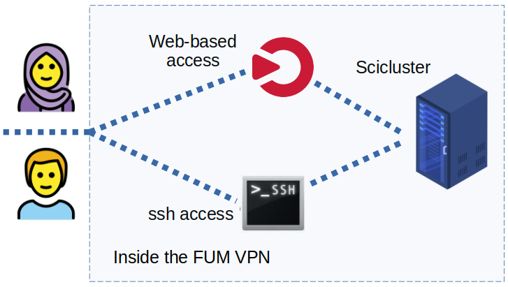

# Logging in for the first time



## Connect to the VPN

Before connecting to the Scicluster login node (currently our frontend node is also the login node), you need to first connect to the VPN. Please do as follow for your preferred OS:

### Gnu/Linux and Mac

- install [openfortivpn](https://github.com/adrienverge/openfortivpn#installing) package. For example for ubuntu-based distros:


```
sudo apt install openfortivpn
```

- open your editor and input the VPN information provided to you as:

```
host = 
port =
username = 
password = 
```

- save the file e.g. in your home as ``my_vpn.conf``.

- run in the terminal:

```
sudo openfortivpn -c ~/my_vpn.conf
```

- enter your local (not the cluster) password and connect.

### Windows

Please go to this [link](https://ict.um.ac.ir/index.php/fa/2021-04-04-03-53-24/2021-04-04-04-17-50/2-uncategorize/368-2021-04-05-05-20-32) and download the client for your OS version. Please read the user guide before installing FortiClient VPN.

### Android

Please download the app via [Google Play](https://play.google.com/store/apps/details?id=com.fortinet.forticlient_vpn) or [Myket](https://myket.ir/app/com.fortinet.forticlient_fa).


## Log in with SSH


An *SSH* (Secure SHell) client is required to connect to sciscluster.
An *SSH* client provides secure encrypted communications between two hosts over an insecure network.

If you already have *ssh* installed on your UNIX-like system, login may be as easy as typing

```
ssh <username>@login-node
```

into a terminal window. Note you must replace login-node with the IP provided to you.


## Log in with an ssh key

To avoid entering your password every time you log in and to increase security, you can log in with an ssh keypair. This keypair consists of a private key that you have to store on your computer and a public key that you can store on sciscluster. On Linux or OSX simply type:

```
ssh-keygen
```

and follow the instructions on the screen. Please use a good passphrase. You will have to enter this passphrase the first time you log in after a reboot of the computer, but not anymore afterwards. To copy the public key to sciscluster, type:

```
ssh-copy-id username@login-node
```

To learn more about ssh keys, have a look at [this](https://wiki.archlinux.org/index.php/SSH_keys) page.

On Windows, you can use PuTTYgen that comes with PuTTY. More information on [ssh.com](https://www.ssh.com/ssh/putty/windows/puttygen).


## SSH clients for Windows and Mac


At the [OpenSSH page](https://www.openssh.com) you will find several *SSH* alternatives for both Windows and Mac.

Please note that Mac OS X comes with its own implementation of *OpenSSH*, so you don't need to install any third-party software to take advantage of the extra security *SSH* offers. Just open a terminal window and jump in.


## Learning more about SSH


To learn more about using SSH, please also consult the [OpenSSH page](https://www.openssh.com) page and take a look at the manual page on your system (*man ssh*).


## Logging in to the compute nodes

Some times you may want to log in to a compute node (for instance to check
out output files on the local scratch space on the compute node). This is also
done by using SSH. On the login node do:

```
ssh compute-node     (for instance: ssh compute-0-1)
```

Please note you must have a running job on this compte node, otherwise SLURM will not allow you to log in to this compute node.
    
## X-forwarding for graphical softwares


If you need [X-forwarding](https://en.wikipedia.org/wiki/X_Window_System) (for instance, if you like to run Mathematica in it's own window) you must log in like this:

```
ssh -Y username@login-node
```
 
Then you must submit an [x11-enabled-interactive-job](../jobs/interactive.md/#x11-enabled-interactive-job) to get a terminal (this will give you access to the compute nodes such as ``compute-0-0``). You should be able to run your program in this terminal and after a few seconds (depending to your network connection) the program window should be appeared. To test it you can test xclock. In this terminal type

```
xclock
```
    
If a small clock appears on your local screen, everything is OK.

