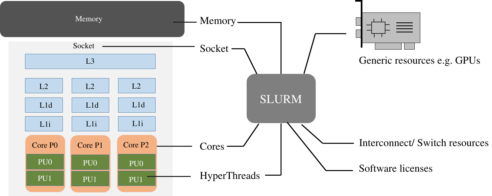

# SLURM Workload Manager

[SLURM](https://slurm.schedmd.com/) is the workload manager and job scheduler for Scicluster. The main function of SLURM is to allocate resources within the cluster to its users. Resource management may include managing nodes, sockets, cores, and hyper-threads. In addition, resource allocation based on the topology, software licenses and generic resources such as GPUs can be managed by SLURM.

Each job has two parts:

- Resource requests: describe the amount of computing resource (CPUs, memory, expected run time, etc.) that the job will need to successfully run.
- Job steps: describe individual tasks that must be executed into a job. You can execute a job step with the SLURM command `srun`. A job can has one or more steps, each consisting in one or more tasks each using one or more CPU, GPU, etc.

There are two ways of starting jobs with SLURM; either interactively with ``srun``
or as a script with ``sbatch`` commands.

Interactive jobs are a good way to test your setup before you put it into a script
or to work with interactive applications like python.
You immediately see the results and can check if all parts behave as you expect.
See [interactive](./interactive.md) section for more details.

!!! note "Resources managed by SLURM"


    - Nodes:
    Node is a computing instance with one or more cores, memory and local storage. Typically, one IP address is assigned to a compute node.

    - Boards:
    A physical motherboard which contains one or more of each of Socket, Memory bus and PCI bus.
        
    - Sockets:
    The receptacle on the motherboard for a physical processor. Depending on the configuration, each socket may contain one or more cores (depending on the processor architecture).
        
    - Cores:
    A complete isolated set of registers, Arithmetic Logic Units and queues to execute a program.
        
    - HyperThreads:
    Within each physical core, the operating system is able to address two virtual cores to increase the number of independent instruction sets processed.
        
    - Memory:
    Memory is made of capacitors and semiconductors to store information for immediate access.
        
    - Topology guide:
    To optimize the job performance, SLURM can be configured to topology-aware resource allocation. Currently, it supports 3D topology and hierarchical topology. The default behavior is to consider all the nodes as a one-dimensional array.
        
    - License guide:
    SLURM also assists with license management by assigning available licenses to jobs at the time of scheduling. If the relevant license is not available, the job will not be executed and will remain in the pending state.

    
    [Ref](https://blogs.oracle.com/research/post/a-beginners-guide-to-slurm)


## SLURM Parameter

[SLURM](https://slurm.schedmd.com) supports a multitude of different parameters.
This enables you to effectively tailor your script to your need when using Scicluster
but also means that it is easy to be confused and waste your time and quota.

The following parameters can be used as command line parameters with ``sbatch`` and
``srun`` or in job script, see [job script examples](./examples.md).
To use these parameters in a job script, start a newline with ``#SBTACH`` directive followed by the parameter.
Replace <....> with the value you want, e.g. ``--job-name=test-job``. The following tables show only the most useful ones.

### General parameters

| Parameter                         | Function                         |
|-----------------------------------|----------------------------------|
| `--job-name=<name>` or `-J <name>`| Job name to be displayed by for example the `squeue` command   |
| `--output=<path>` or `-o <name>` | Path to the file where the job output is written to |
| `--error=<path>` or `-e <name>`  | Path to the file where the job error is written to |
| `--mail-type=<type>`             | Turn on mail notification; type can be one of BEGIN, END, FAIL, REQUEUE or ALL   |
| `--mail-user=<email_address>`    | Email address to send notifications to        |


### Requesting Resources parameters

| Parameter                         | Function                        |
|-----------------------------------|---------------------------------|
| ``--time=<d-hh:mm:ss>`` | Time limit for job. Job will be killed by SLURM after time has run out. Format days-hours:minutes:seconds|
| ``--nodes=<num_nodes>`` or `-N` | Number of nodes. Multiple nodes are only useful for jobs with distributed-memory (e.g. MPI).|
| ``--mem=<MB>`` |  Memory (RAM) per node. Number followed by unit prefix `K|M|G|T`, e.g. 16G|
| ``--mem-per-cpu=<MB>``| Memory (RAM) per requested CPU core. This option with the value of 512 M is set as the default for all partitions.|
| `--ntasks=<num_procs>` or `-n` | Number of processes. Useful for MPI jobs. |
| ``--ntasks-per-node=<num_procs>`` | Number of processes per node. Useful for MPI jobs. Maximum number is node dependent (number of cores) |
| ``--cpus-per-task=<num_threads>`` or `-c` | CPU cores per task. For OpenMP (i.e. shared memory) or hybrid OpenMP/MPI use one. Should be equal to the number of threads. |
| ``--exclusive`` | Job will not share nodes with other running jobs. You will be charged for the complete nodes even if you asked for less. |

### Accounting parameters

See also [partitions](#partitions-queues).

| Parameter | Function |
|-----------|----------|
| ``--account=<name>`` | Project (not user) account the job should be charged to. |
| ``--partition=<name>`` or ``-p`` | Partition/queue in which o run the job. |
| ``--qos=<...>`` | The quality of service requested; can be *low*, *normal* or *high* |

### Advanced Job Control parameters

| Parameter | Function |
|-----------|----------|
| ``--array=<indexes>``  | Submit a collection of similar jobs, e.g. ``--array=1-10``. (sbatch command only). See official [SLURM documentation](https://slurm.schedmd.com/job_array.html).|
| ``--dependency=<state:jobid>`` | Wait with the start of the job until specified dependencies have been satisfied. E.g. `--dependency=afterok:123456` |
<!-- | ``--ntasks-per-core=2`` | Enables hyperthreading. Only useful in special circumstances. | -->

<!-- !!! tip "Differences between CPUs and tasks"

    As a new users writing your first SLURM job script the difference between
    ``--ntasks`` and ``--cpus-per-task`` is typically quite confusing.
    Assuming you want to run your program on a single node with  16 cores, which
    SLURM parameters should you specify?

    The answer is it depends whether your application supports MPI.
    MPI (message passing protocol) is a communication interface used for developing
    parallel computing programs on distributed memory systems.
    This is necessary for applications running on multiple computers (nodes) to be able to
    share (intermediate) results.

    To decide which set of parameters you should use, check if your application utilizes
    MPI and therefore would benefit from running on multiple nodes simultaneously.
    On the other hand you have an non-MPI enables application or made a mistake in
    your setup, it doesn't make sense to request more than one node. -->


## Settings for OpenMP and MPI jobs

### Single node jobs

For applications that are not optimized for HPC (high performance computing) systems
like simple python or R scripts and a lot of software which is optimized for desktop PCs.

#### Simple applications and scripts

Many simple tools and scripts are not parallelized at all and therefore won't profit from
more than one core.

| Parameter | Function |
|------------|---------|
| ``--nodes=1`` | Start a job on only one node |
| `--ntasks=1`  | One task is requested |
| ``--mem=<MB>`` | Memory (RAM) for the job. Number followed by unit prefix, e.g. 16G |

If you are unsure if your application can benefit from more cores try a higher number and
observe the load of your job. If it stays at approximately one there is no need to ask for more than one.


#### OpenMP applications

OpenMP (Open Multi-Processing) is a multiprocessing library which is often used for programs on
shared memory systems. Shared memory describes systems that share the memory between all
processing units (cores), so that each process can access all data on that system.

| Parameter | Function |
|-----------|----------|
| ``--nodes=1`` | Start a parallel job for a shared memory system on only one node |
| ``--ntasks-per-node=1`` | For OpenMP, only one task is necessary |
| ``--cpus-per-task=<num_threads>`` | Number of threads (CPU cores) to use |
| ``--mem=<MB>`` | Memory (RAM) for the job. Number followed by unit prefix, e.g. 16G |


### Multiple node jobs (MPI)

For MPI applications.

Depending on the frequency and bandwidth demand of your setup, you can either just start a number of MPI tasks or request whole nodes.
While using whole nodes guarantees a lower latency and higher bandwidth it usually results in a longer queuing time compared to cluster wide job.
With the latter the SLURM manager can distribute your task across all nodes of Scicluster and
utilize otherwise unused cores on nodes which for example run a 6 core job on a 8 core node.
This usually results in shorter queuing times but slower inter-process connection speeds.

#### To use whole nodes

| Parameter | Function |
|-----------|----------|
| ``--nodes=<num_nodes>`` | Start a parallel job for a distributed memory system on several nodes |
| ``--ntasks-per-node=<num_procs>`` | Number of (MPI) processes per node. Maximum number depends on node type |
| ``--cpus-per-task=1`` | Use one CPU core per task. |
| ``--exclusive`` | Job will not share nodes with other running jobs. You don't need to specify memory as you will get all available on the node. |

#### Cluster wide

| Parameter | Function |
|-----------|----------|
| ``--ntasks=<num_procs>`` | Number of (MPI) processes in total. Equals to the number of cores |
| ``--mem-per-cpu=<MB>`` | Memory (RAM) per requested CPU core. Number followed by unit prefix, e.g. 1G |

### Scalability

You should run a few tests to see what is the best fit between minimizing
runtime and maximizing your allocated cpu-quota. That is you should not ask for
more CPUs for a job than you really can utilize efficiently. Try to run your
job on 1, 2, 4, 8, 16, etc., cores to see when the runtime for your job starts
tailing off. When you start to see less than 30% improvement in runtime when
doubling the cpu-counts you should probably not go any further.


## Job related environment variables

Here we list some environment variables that are defined when you run a job
script.  This is not a complete list. Please consult the SLURM documentation
for a complete list.

Job number:

```
SLURM_JOBID
SLURM_ARRAY_TASK_ID  # relevant when you are using job arrays
```

List of nodes used in a job:

```
SLURM_NODELIST
```

Submit directory (this is the directory where you have sbatched your job):

```
SUBMITDIR
SLURM_SUBMIT_DIR
```

Default number of threads:

```
OMP_NUM_THREADS=1
```

Task count:

```
SLURM_NTASKS
```

