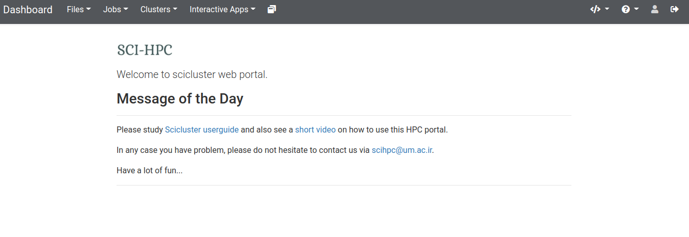

# Web Portal

!!! note

    Please replace **login-node** with the IP provided to you, everywhere in this user guide.

Scicluster provides a nice web portal using [OnDemand](https://openondemand.org) to see and submit jobs, to browse, upload, download and copy files, to work with the terminal in the browser and more interestingly web-based access to the [Jupyter](https://jupyter.org) that could be run in the compute nodes beautifully.


## Logging in

To login into the portal, you must have already a cluster [account](../about/getting-started.md/#get-an-account). Please connect to the VPN address provided to you, then go to this address in your web browser [https://login-node](https://login-node) . You may face with a potential security warning. This is because we do not get a registered certificate. This is not important and you could go on. After this part, you should be able to see the welcome page



## Preparing OnDemand Folder

The OnDemand web portal makes a folder in your home directory once you login for the first time and saves its files there. As the home [quota](../storage/storage.md/#quota) is very limited, it is a good practice to move this folder to ``/work8/your_username`` and make a link to this now dislocated ``~/ondemand`` folder. So do

```bash
mv ~/ondemand /work8/$USER/ondemand
ln -s /work8/$USER/ondemand ~/ondemand
```

!!! note
    If you have any problem with the portal, first try to log out and login again.
    Next, try to clear all cookies for the domain `login-node`.
    Finally, try the `Help > Restart Web Server` link to restart the portal.
    


## Portal Dashboard

The dashboard has different menus. Here we explain them but not with detail.

### Files

- **Home Directory** - Here, you can browse, see and edit your files in the frontend node. For editing files, there is a nice web-based editor.
- **/work8/your_username** - Your disk space on ``/work8``.

If you have assigned disk space on other storages [storages](../storage/storage.md), they should also be appeared in the menu.

### Jobs

- **Active Jobs** - List all and delete your jobs.
- **Job Composer** - Start a new job.

### Clusters

- **Shell Access** - Shell access in your browser.

### Interactive Apps

- **Computational containerized Desktops** - Start virtual desktops on the HPC (e.g. for plotting your data).
- **Jupyter** - Run Jupyter on the HPC and easily connect to it from your browser without setting up any SSH tunnels.

### My Interactive Sessions

See details of your currently running interactive sessions.

### Help

- **Restart Web Server** - Try this if the portal acts weird before contacting us. The web portal runs a web server per user, so this does not affect any other user.

### Log Out

- Log out of the portal.
